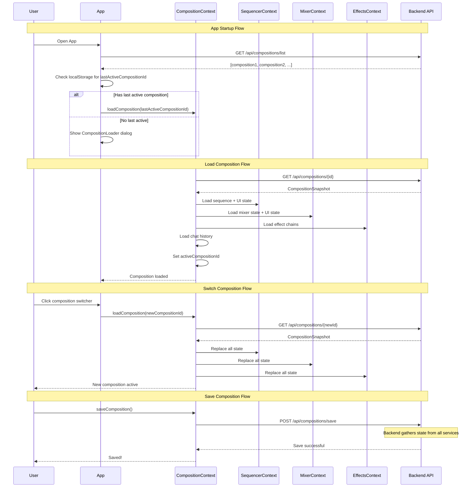

```mermaid
sequenceDiagram
    participant User
    participant App
    participant CompCtx as CompositionContext
    participant SeqCtx as SequencerContext
    participant MixCtx as MixerContext
    participant EffCtx as EffectsContext
    participant API as Backend API

    Note over User,API: App Startup Flow
    User->>App: Open App
    App->>API: GET /api/compositions/list
    API-->>App: [composition1, composition2, ...]
    App->>App: Check localStorage for lastActiveCompositionId
    alt Has last active composition
        App->>CompCtx: loadComposition(lastActiveCompositionId)
    else No last active
        App->>App: Show CompositionLoader dialog
    end

    Note over User,API: Load Composition Flow
    CompCtx->>API: GET /api/compositions/{id}
    API-->>CompCtx: CompositionSnapshot
    CompCtx->>SeqCtx: Load sequence + UI state
    CompCtx->>MixCtx: Load mixer state + UI state
    CompCtx->>EffCtx: Load effect chains
    CompCtx->>CompCtx: Load chat history
    CompCtx->>CompCtx: Set activeCompositionId
    CompCtx-->>App: Composition loaded

    Note over User,API: Switch Composition Flow
    User->>App: Click composition switcher
    App->>CompCtx: loadComposition(newCompositionId)
    CompCtx->>API: GET /api/compositions/{newId}
    API-->>CompCtx: CompositionSnapshot
    CompCtx->>SeqCtx: Replace all state
    CompCtx->>MixCtx: Replace all state
    CompCtx->>EffCtx: Replace all state
    CompCtx-->>User: New composition active

    Note over User,API: Save Composition Flow
    User->>CompCtx: saveComposition()
    CompCtx->>API: POST /api/compositions/save
    Note over API: Backend gathers state from all services
    API-->>CompCtx: Save successful
    CompCtx-->>User: Saved!
```